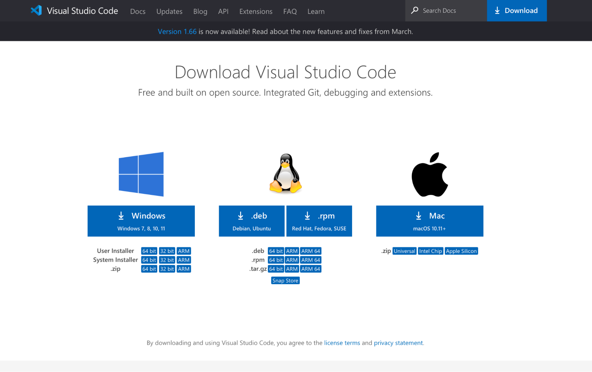

**How to log into a course-specific account on ieng6:**

**Install VSCODE:**

Download your specific version of VSCODE and install it onto your computer. Make sure you are choosing the correct operating system when installing or else it will not work.

---

**Remote Connection to server:**

This is an example of the command that should be used when connecting to ieng6. Using ssh, enter your username in the following format:
 ssh <username>@ieng6.ucsd.edu
This should prompt you for a password which you should enter accordingly. Entering the password correctly should redirect you to an image like this:

---

**Try out commands:**

There are many different commands that can be used in the terminal. Try some out and see what they do. Examples will be provided below:

ls will list the different files in the directory, cd will enter a file in the directory, and cd .. will bring you back to the last directory used.

---
**Moving files with scp:**

In order to move files with scp, you should first find the file that you would like to move.  Then activate the following command and fill in the portions that are in the [] brackets:

scp [filename] [username]@ieng6.ucsd.edu:~/
This will move the file from your local machine to the server which is shown in the following screenshot:

The file name will be different for you, but in general this screen is what would show up when logging into the server and using ls

---
**Setting an SSH Key:**

To set an SSH Key, first use the following commands and substitute in the needed variables:

*$ ssh-keygen*

You will then be prompted as follows:

*Generating public/private rsa key pair.
Enter file in which to save the key (/Users/[user-name]/.ssh/id_rsa): /Users/[user-name]/.ssh/id_rsa*

Make sure to enter the command above, and for the next step press enter:

*Enter passphrase (empty for no passphrase):*

It’s important to press enter to ensure that no password is needed.
Enter the same password again when prompted (enter key):

*Enter same passphrase again:*

And now the following should be printed out for you, note that this will not be exactly what you get, but should at least look similar:

Your identification has been saved in /Users/<user-name>/.ssh/id_rsa.

Your public key has been saved in /Users/<user-name>/.ssh/id_rsa.pub.

The key fingerprint is:
SHA256:jZaZH6fI8E2I1D35hnvGeBePQ4ELOf2Ge+G0XknoXp0 [user-name]@[system].local

The key's randomart image is:

+---[RSA 3072]----+

|                 |

|       . . + .   |

|      . . B o .  |

|     . . B * +.. |

|      o S = *.B. |

|       = = O.*.*+|

|        + * *.BE+|

|           +.+.o |

|             ..  |

+----[SHA256]-----+

Now you should be able to log in remotely without needing to provide a password, try this using the ssh command once again.

---
**Optimizing Remote Running:**

Now that all of these steps are complete, there is the question of the most effective way to run all of these commands while minimizing the time it takes to optimally use them. You can use a variety of functions to activate multiple commands on one line and on the server by using a combination of quotation marks and semicolons. An example below is provided:

By running all of these commands in conjunction with one another, I was able to move the “WhereAmI.java” file to the server, compile it, and run it as well. This saves you from using more keystrokes as there isn’t a need to hit the enter button multiple times since it’s all on one line. There are more ways to possibly shorten commands like these, but this an example of how you could shorten them using shortcuts like semicolons.