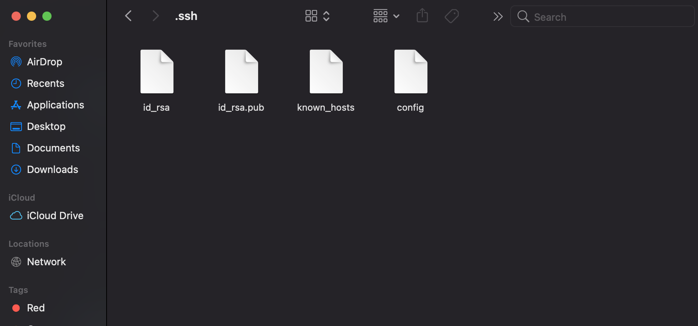
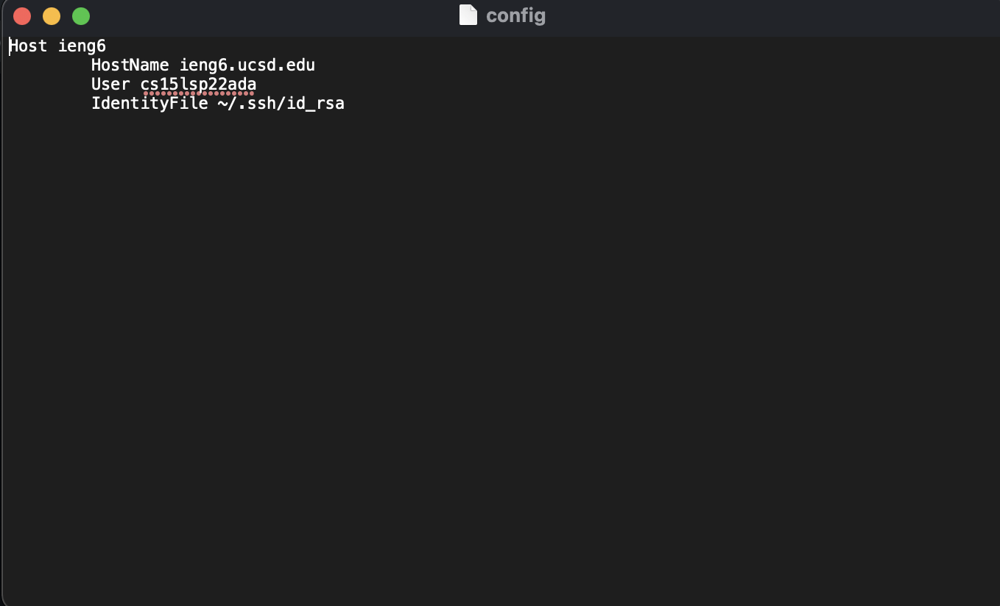
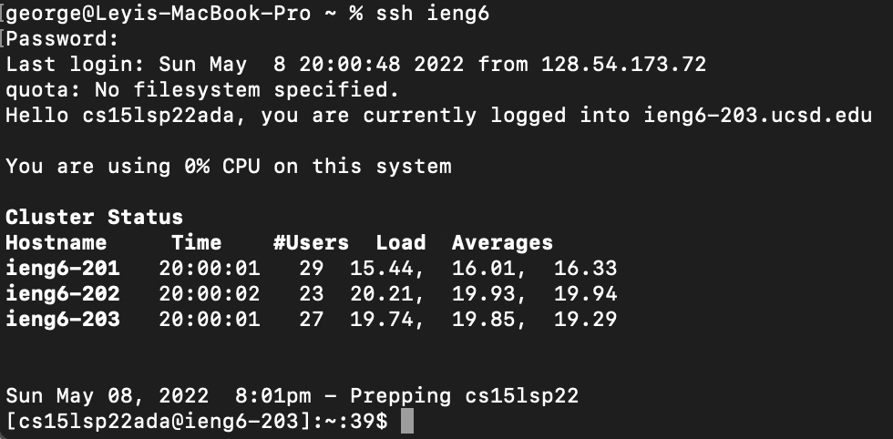
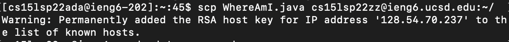
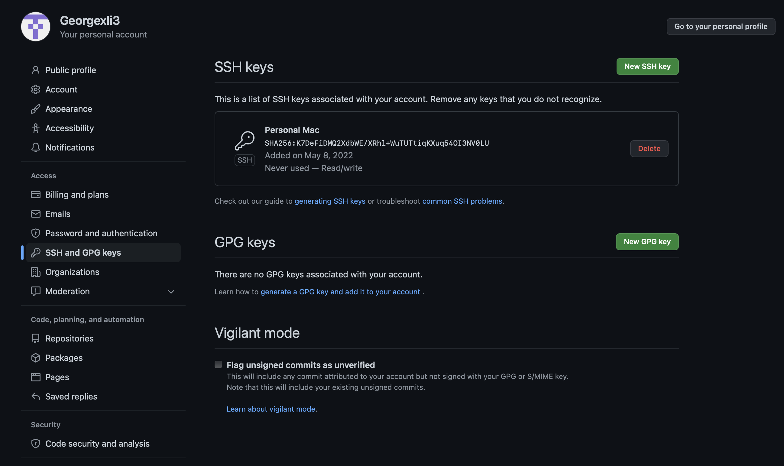
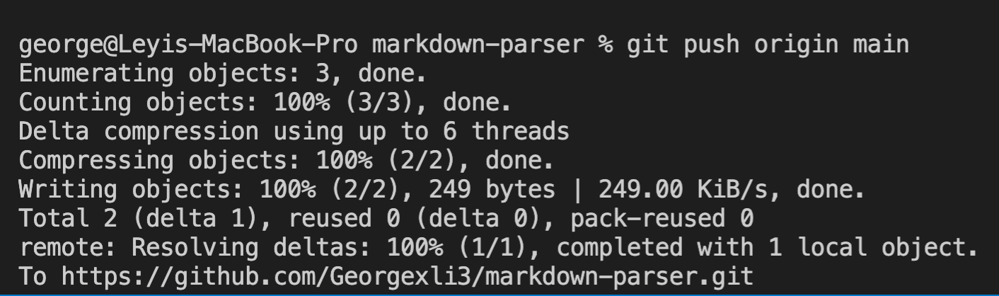
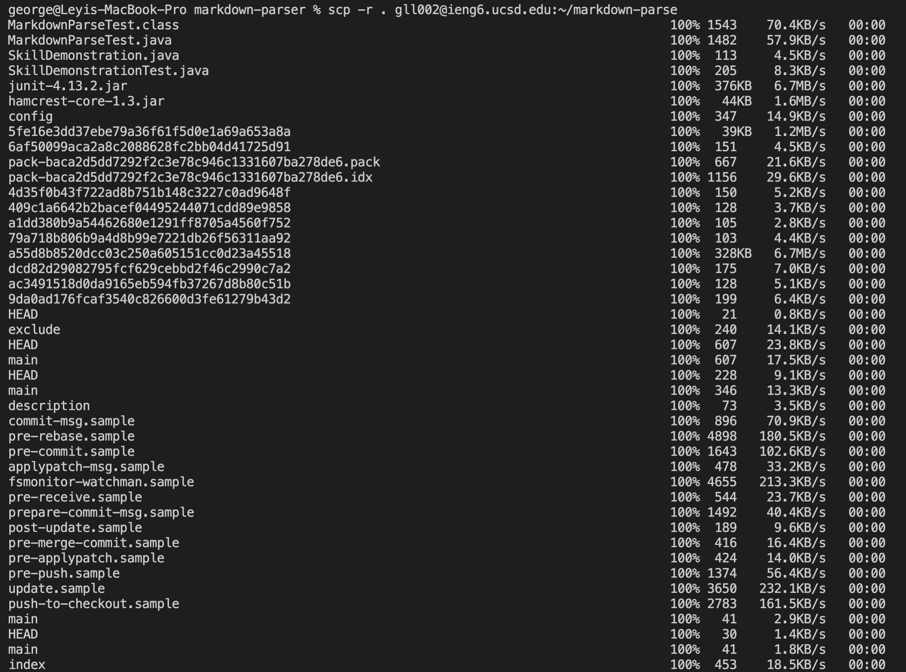
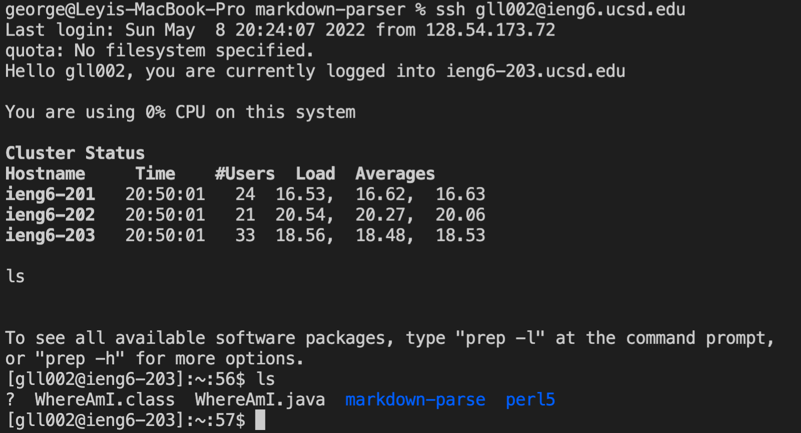
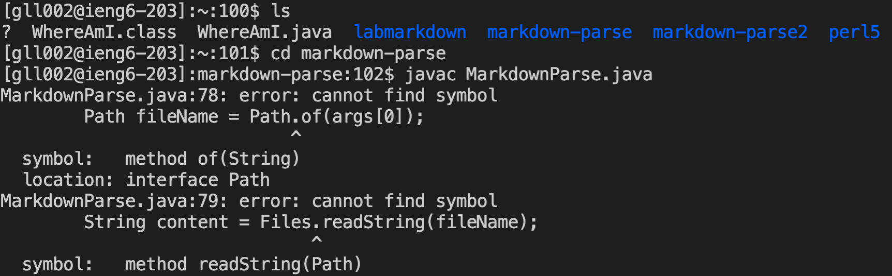
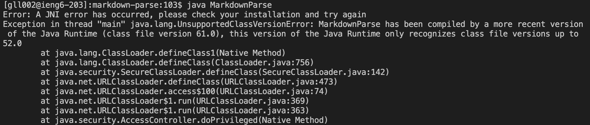

# **Streamlining ssh Configuration**
**.ssh/config file:**

(I used Notepad to edit the config file)
---
**Logging in using ssh ieng6:**

---
**Using scp on alias:**

---
**Description of streamlining:**
The goal of streamlining the ssh configuration is to login to a server without needing to type as much out. To do this, a config file is added to the .ssh file with commands in order to quickly access the correct account in the server (shown in the screenshots above).
---

# **Setup Github Access from ieng6**
**Public Key Location:**

---
**Private Key Location:**

---
**Running git commands:**

---
**Link to Commit:**
[Link to Commit](https://github.com/Georgexli3/markdown-parser/commit/77427a46ee90ba9e3399877e754144ce6701fe93)
---
**Description of Github Access:**
In order to easily access the github server remotely, an ssh key can be used to bypass the need to login to github using a password. This allows commits and pushing to origin remotely from a local machine without the need of always going into github.
---

# **Copy whole directories with scp -r**
**Copying:**

---
**Compile and run:**

---
**Description of copying whole directories:**
By using scp -r, whole directories are allowed to be added to a server remotely. This is much better than the alternative which is using scp on every single file to add it to a server which may take a long time depending on how many files need to be added.