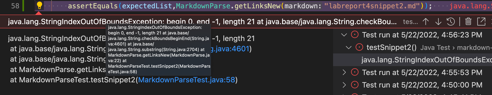
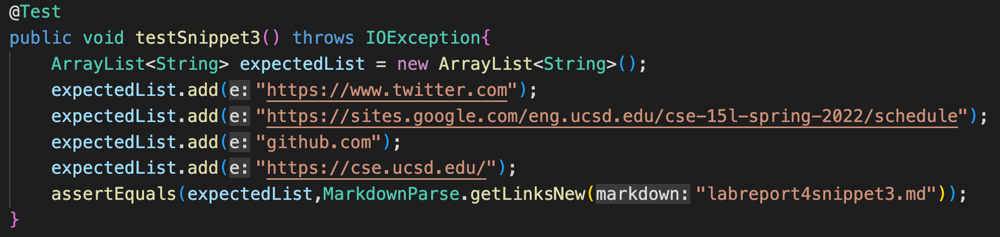

# **Lab Report 4**
**Links to repositories:**
[My Repostiory](https://github.com/Georgexli3/markdown-parse-new)
[Their Repository](https://github.com/chw081/markdown-parser)

---
**Test #1:**

This is the test that I added to my own repository for code snippet 1. The test should have an expected output of: [url.com, google.com, google.com, ucsd.edu].

This is the error that my code recieves when trying to run the test. The test shows that there is an IndexOutOfBoundsException which prevents the code from running in the first place. This is due to a bug with my code.

This is the test that I added to the other repository I reviewed for week 7's lab. The test has the same expected output as the one I made for own code.

This is the error the their code receives when trying to run the test. The test shows that it fails due to the expected output not being the same as the actual output. The actual output produces an empty list.

---
**Test #2:**

This is the test that I added to my own repository for code snippet 1. The test should have an expected output of: [a.com, b.com, example.com].

This is the error that my code recieves when trying to run the test. The test shows that there is an IndexOutOfBoundsException which prevents the code from running in the first place. This is due to a bug with my code.

This is the test that I added to the other repository I reviewed for week 7's lab. The test has the same expected output as the one I made for own code.

This is the error the their code receives when trying to run the test. The test shows that it fails due to the expected output not being the same as the actual output. The actual output produces an empty list.

---

**Test #3:**

This is the test that I added to my own repository for code snippet 1. The test should have an expected output of: [https://www.twitter.com, https://sites.google.com/eng.ucsd.edu/cse-15l-spring-2022/schedule, github.com, https://cse.ucsd.edu/].

This is the error that my code recieves when trying to run the test. The test shows that there is an IndexOutOfBoundsException which prevents the code from running in the first place. This is due to a bug with my code.

This is the test that I added to the other repository I reviewed for week 7's lab. The test has the same expected output as the one I made for own code.

This is the error the their code receives when trying to run the test. The test shows that it fails due to the expected output not being the same as the actual output. The actual output produces an empty list.

---

## **Questions:**

**Q1: Do you think there is a small (<10 lines) code change that will make your program work for snippet 1 and all related cases that use inline code with backticks? If yes, describe the code change. If not, describe why it would be a more involved change.**

A1: I think it would be possible to implement a small change into my code that would allow for the first code snippet to work. The change would most likely check the strings at the current indexes to see if there are certain symbols inside of the string. The code would scan each letter of the string one by one to see if there are backticks that aren't allowed.

---
**Q2: Do you think there is a small (<10 lines) code change that will make your program work for snippet 2 and all related cases that nest parentheses, brackets, and escaped brackets? If yes, describe the code change. If not, describe why it would be a more involved change.**

A2: It would be possible to change the program to work for these cases, however I do not think it can be done in only ten lines or less. This is because there are simply too many things to check for in a link and checking for each one would have at least one to two lines of code dedicated for the check. This would end up making it much longer than ten lines of code in the end.

---
**Q3: Do you think there is a small (<10 lines) code change that will make your program work for snippet 3 and all related cases that have newlines in brackets and parentheses? If yes, describe the code change. If not, describe why it would be a more involved change.**

A3: Yes I think that it would be possible to make a small code change to make the code implementation work for snippet 3. The code implementation would have to check for any empty space between the brackets and parentheses, and if there are spaces then it would remove them from the output of the code running. It's also possible to skip the spaces instead of removing them to get the next character.