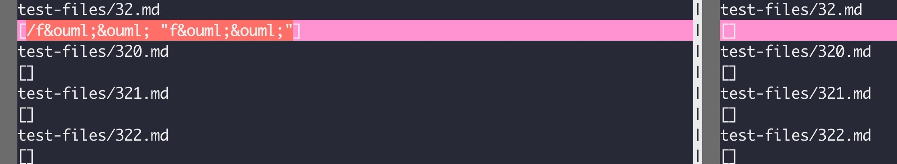
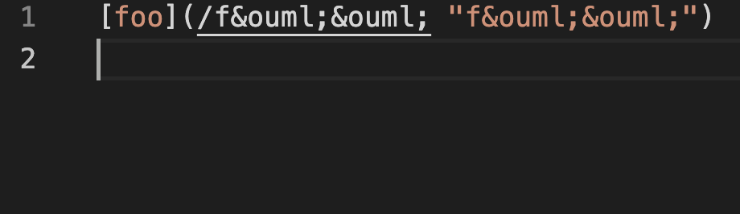
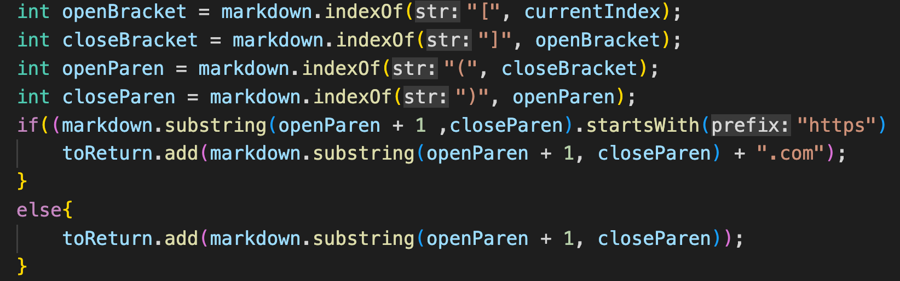
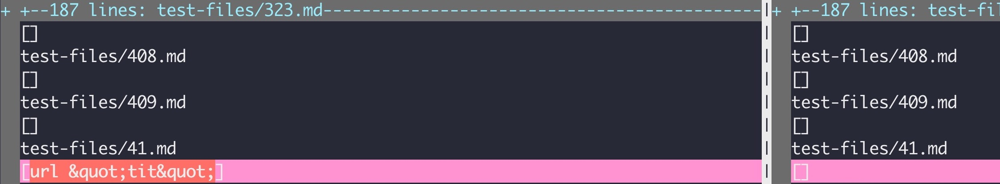
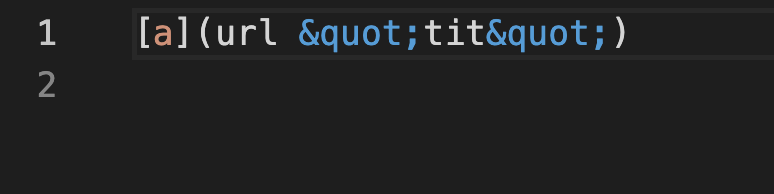

# **Lab Report 5**
**Repository with different test:**
[Repostiory](https://github.com/nidhidhamnani/markdown-parser/blob/main/test-files/32.md)

---
**Note:**
In order to find the test with the different results, I used vimdiff on both MarkdownParsers on the same file and exported them to different text files that contained the output.

---

The following screenshot shows vimdiff running on two different outputs of the MarkdownParser code. On the left is my code and on the right is the code provided by the github repository of the tutor.
 
 
As you can see from the above screenshot, my output shows on the left is not the same as the output of on the right which is empty. Unfortunately, my output does not produce the correct expected output.
 

 
The screenshot above shows what is contained in the test file, and since there are no valid links in the file, the expected output should produce an empty list of links.
 
 
What most likely happened with my code is that it read the open and close brackets as well as the open and close parentheses and simply printed the contents of them without determining if they were actually links. The bug had to do simply with my implementation of getLinks and how it only focuses on the indexes of the close and open parentheses/brackets.
 
 
In particular, I would most likely need to change the following code snippet:
 

As you can see the indexes of the brackets and parentheses are constantly updating and simply adding everything inbetween regardless if it's actually a link or not. Something would need to change here that can distinguish between what is actually a link or not.

---

The following screenshot again shows vimdiff running on two different outputs of the MarkdownParser code. On the left is my code and on the right is the code provided by the github repository of the tutor.
 
 
From the above screenshot, my output shown on the left is not the same as the output of on the right which is empty. Unfortunately, my output does not produce the correct expected output.
 

 
The screenshot above shows what is contained in the test file, and since there are no valid links in the file, the expected output should produce an empty list of links.
 
 
Again, what most likely happened with my code is that it read the open and close brackets as well as the open and close parentheses and simply printed the contents of them. The bug had to do simply with my implementation of getLinks and how it only focuses on the indexes of the close and open parentheses/brackets.
 
 
In particular, I would most likely need to change the following code snippet again:
 

As you can see the indexes of the brackets and parentheses are constantly updating and simply adding everything inbetween regardless if it's actually a link or not. Something would need to change here that can distinguish between what is actually a link or not.